# Raytracer
This is my implementation of the book [_Ray Tracing in One Weekend_](https://raytracing.github.io/books/RayTracingInOneWeekend.html)
by [*Peter Shirley*](https://github.com/petershirley) in Rust.

## Final result
**Image size:** 1200 x 800 pixels
**Samples per pixel:** 500

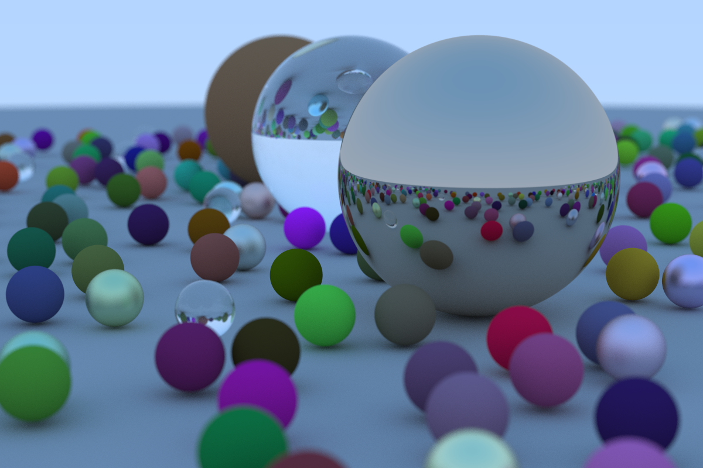

## Dependencies
- image "0.23.9"
- rand "0.7.3"

## Build
```bash
cargo build --release
```

## Run
```bash
cargo run --release
```

## The Process

### First Image
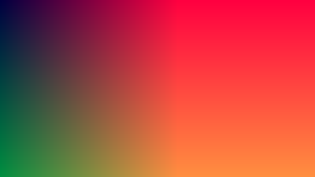

### Gradient Background


### A Sphere
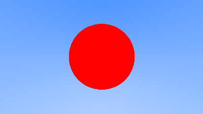

### Surface Normals
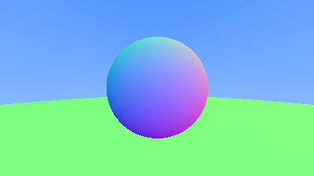

### Anti-aliasing
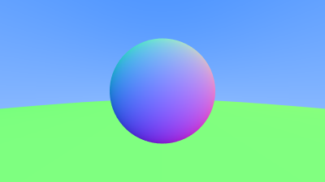

### Diffuse
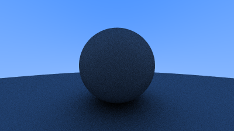

### Lambertian Reflection
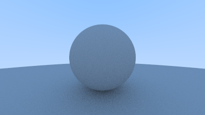

### Materials
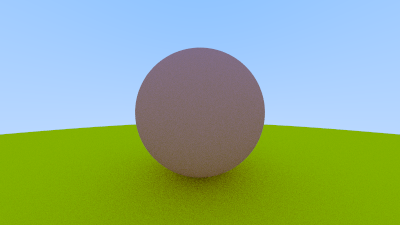

### Metal
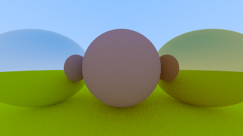

### Fuzzy Metal
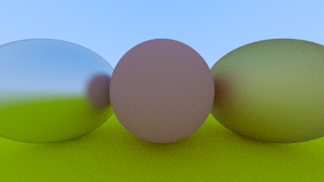

### Refractive Material
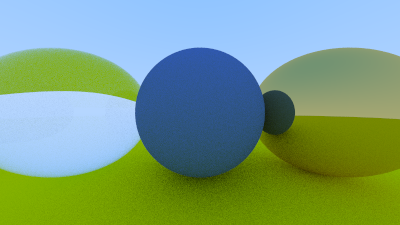

### Camera Position
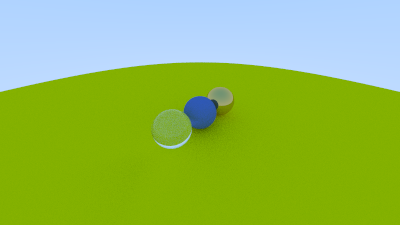

### Defocus Blur
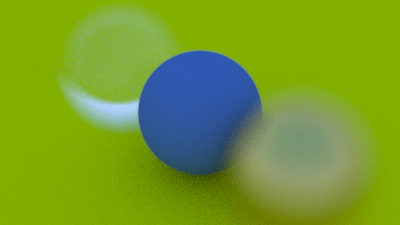

### The Final Render
